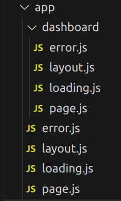
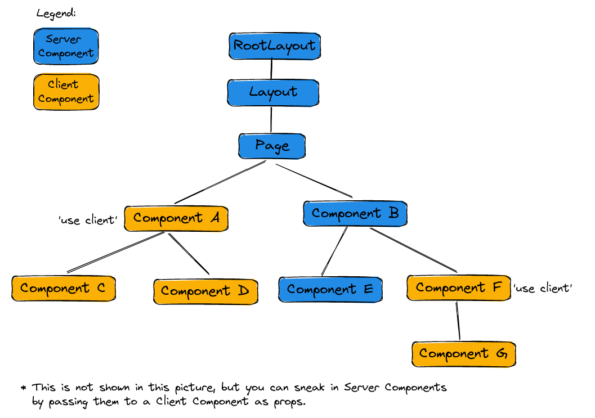

# Next.js App Router & new features

- [Routing](#routing)
- [Server Components](#server-components)
- [Data Fetching](#data-fetching)
- [Streaming and Suspense](#streaming-and-suspense-with-server-components)
- [API / Route Handlers](#api--route-handlers)
- [Advantages](#advantages)

## Routing

What has changed?:

- Use the _app_ directory instead of the _pages_ directory (incremental adoption is possible)
- New file conventions: _page.js_, _layout.js_, _loading.js_, _error.js_, etc.: [file conventions docs](https://nextjs.org/docs/app/building-your-application/routing#file-conventions)



=> Hint: Layouts are nesting / composed. So the layout and page in `/app/dashboard` would be nested in the root layout in `/app/layout.js`

- The components are rendered in a specific hierarchy: [component hierarchy docs](https://nextjs.org/docs/app/building-your-application/routing#component-hierarchy)
- No `_app.js` file. Instead share layouts through the layout component in the app folder (the Root Layout).
  - It is not possible to share state between a layout component and its children by passing down props

```js
export default function RootLayout({ children }) {
  return (
    <html lang="en">
      <body className={inter.className}>
        <main className={styles.main}>{children}</main>
        <Navigation />
      </body>
    </html>
  );
}
```

- No `_document.js` file and no need to import Next.js specific `<Head>`, `<Body>`, `<Html>` components, but instead just use React with "ordinary html tags".
- You can colocate other files, like components, tests, etc. inside the app folder.
- useful:
  - how to access dynamic route segments: [docs](https://nextjs.org/docs/app/building-your-application/routing/dynamic-routes#example)
  - statically generate routes at build time: [docs](https://nextjs.org/docs/app/building-your-application/routing/dynamic-routes#generating-static-params)

## Server Components

When using the new app router, per default all components are Server Components, unless:

- you mark them as a Client Component using the use client directive in the first line of your component file:

```js
"use client";

export default function MyClientComponent() {
    ...
}
```

- Your component is being used in another Client Component (except for usage through props)

```js
"use client";

import OtherComponent from "@components/OtherComponent";

export default function MyClientComponent() {
  return (
    <section>
      <h2>My Client Component</h2>
      {/* All components we use here turn into client components, except for those we receive through props - like children */}
      <OtherComponent />
    </section>
  );
}
```

A typical component tree:



What are Server Components:

- Server Components are only rendered on the server - never on the client
  - Client Components can be rendered on the server and on the client (prerendering on the Server and then hydration on the client)
- Server components have access to environment variables => e.g.: They can query your database directly
- Server components should be used when:
  - fetching data
  - accessing backend resources like databases
  - using secret environment variables like API keys
- Server components cannot:
  - add interactivity (onClick, onSubmit, etc.)
  - use state and lifecycle effects, e.g.: useState, useEffect, useContext
  - use browser only APIs like localStorage
  - use custom hooks that use state, effects, or browser only APIs (that includes useStore hook in Zustand and useReducer hook in Redux)
- styled components is not currently working with server components
- useful: To prevent unintended client usage of server code, the "server only" package can be helpful: [server only package](https://nextjs.org/docs/getting-started/react-essentials#the-server-only-package)

[when to use Server and Client Components](https://nextjs.org/docs/getting-started/react-essentials#when-to-use-server-and-client-components)

[thinking in Server Components](https://nextjs.org/docs/getting-started/react-essentials#thinking-in-server-components)

[moving Client Components to the leaves](https://nextjs.org/docs/getting-started/react-essentials#thinking-in-server-components)

[passing props from Server to Client Components](https://nextjs.org/docs/getting-started/react-essentials#passing-props-from-server-to-client-components-serialization)

## Data Fetching

It is recommended to always fetch data on the server (in a Server Component).
With the App Router we do not use `getServerSideProps` and `getStaticProps` anymore, instead we call our async functions (like fetch) directly in the component:

```js
export default async function Page() {
  const response = await fetch("https://example-apis.vercel.app/api/art");
  const artPieces = await response.json();

  return (
    <>
      <header>
        <h1>Art Pieces Overview</h1>
      </header>
      <ArtPiecesList pieces={artPieces} />
    </>
  );
}
```

Caching:
Per default all `fetch()` requests are cached. If you use the same request multiple times, all but the first request will use the cached result.
You can make your cache revalidate (set a maximum life time of the cache before refetching from the source) by using the `next.revalidate` option in `fetch()`:

```js
// sets life time of cache to 60 seconds
fetch(url, { next: { revalidate: 60 } });
```

This will have an effect in dev mode and on statically generated sites (Incremental Static Regeneration).
Opt out of caching by:

```js
// Option A:
fetch(url, { cache: "no-store" });
// Option B:
fetch(url, { next: { revalidate: 0 } });
```

## Streaming and Suspense with Server Components

Streaming allows you to break down your UI into small chunks and send them progressively to the client.
If a part of your UI needs to fetch some data for example, you can send the static parts of your data directly upon navigation and send the rest of your UI when the data is fetched and the component rendered.

### Loading States

If your page has a `layout.js`, `loading.js` and a `page.js` that needs to fetch data, then first the layout with the loading UI will be displayed and the content of the page will replace the loading UI once the data is fetched and the component rendered:

```js
export default function Loading() {
  return <div>Loading...</div>;
}
```

```js
export default function Layout({ children }) {
  return (
    <>
      {children}
      <Navigation />
    </>
  );
}
```

```js
export default async function Page() {
  const cards = await fetchCards();

  return <Cards cards={cards} />;
}
```

UI that renders early:

```js
<>
  <div>Loading...</div>
  <Navigation />
</>
```

UI after fetching:

```js
<>
  <Cards cards={cards} />
  <Navigation />
</>
```

### Using Suspense

You can make use of streaming by deciding which specific parts should be rendered early and which parts should be rendered later once they are rendered. Just wrap the components that need to fetch data inside a suspense:

```js
export default function Page() {
  return (
    <>
      <header>
        <h1>My awesome app</h1>
      </header>
      <Suspense fallback={<div>Loading...</div>}>
        <PageContent />
      </Suspense>
    </>
  );
}

async function PageContent() {
  const cards = await fetchCards();

  return <Cards cards={cards} />;
}
```

UI that renders early:

```js
<>
  <header>
    <h1>My awesome app</h1>
  </header>
  <div>Loading...</div>
</>
```

UI after fetching:

```js
<>
  <header>
    <h1>My awesome app</h1>
  </header>
  <Cards cards={cards} />
</>
```

## API / Route Handlers

Place `route.js` files inside the app directory to define new api routes. There **cannot** be a `route.js` file in the same route segment as a `page.js`.

You can define `GET`, `POST`, `PUT`, `PATCH`, `DELETE`, `HEAD`, and `OPTIONS` methods that consume a [Request](https://developer.mozilla.org/en-US/docs/Web/API/Request) and return a [Response](https://developer.mozilla.org/en-US/docs/Web/API/Response):

Returning data:

```js
import { NextResponse } from "next/server";

export async function GET() {
  // get data from API / database / really anywhere
  const data = await getData();

  return NextResponse.json(data);
}
```

Returning error:

```js
import { NextResponse } from "next/server";

export async function GET() {
  return NextResponse.json(
    {
      message: "You caused a specific error",
    },
    {
      status: 400,
    }
  );
}
```

Full Docs: [Docs on Route Handlers](https://nextjs.org/docs/app/building-your-application/routing/router-handlers)

Important: [Dynamic route segments](https://nextjs.org/docs/app/building-your-application/routing/router-handlers#dynamic-route-segments)

## Advantages

- Streaming allows to display parts of the page early while other parts are still loading
- Server components leverage the server and decrease bundle size
- Usage of Next.js specific Components and APIs gets reduced => More vanilla JavaScript and React
- Nested Layouts allow sharing UI between routes easily
- Colocate files inside your app folder next to pages
